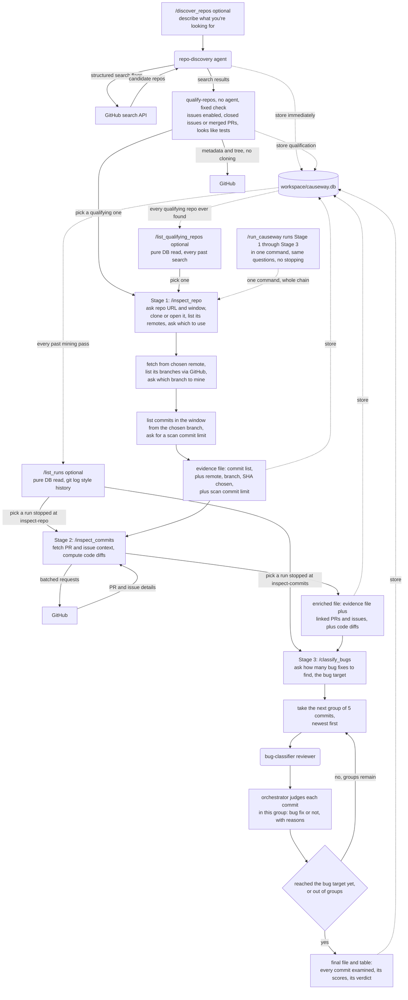

# Causeway Mini

New here? [GETTING_STARTED.md](GETTING_STARTED.md) walks through installing everything and running a first real mining pass, start to finish.

## What is this?

Causeway Mini looks through a public GitHub project's history and figures out which past changes were actually bug fixes, as opposed to new features, cleanup, or documentation changes, and explains why it thinks so for each one.

In short, it:

- Takes a GitHub repo URL (or helps you find one) and a time window ("past 3 months", say).
- Finds every commit in that window.
- Digs up extra context for each commit from GitHub: was there a linked pull request, a bug report, an issue discussion.
- Computes the actual code change (the diff) for each commit.
- Sends each commit to an independent AI reviewer, which scores it on message, diff, and linked PR/issue content.
- Reads those scores and decides, commit by commit, genuine bug fix or not, stopping once it's found as many as you asked for.

Everything runs through a handful of chat commands, typed one after another in Claude Code, each one picking up where the last left off. You can either run each stage yourself, one command at a time, or run `/run_causeway` once to go through the whole thing without stopping in between. Both paths ask exactly the same questions and produce exactly the same result, "The commands, in order" below covers this in detail.

## The pipeline at a glance

| Stage | Command | You give it | It produces |
|---|---|---|---|
| Discover (optional) | `/discover_repos` | a plain-language description of what you're looking for | candidate repositories, stored in the catalog |
| Revisit (optional) | `/list_qualifying_repos` | nothing (or how many to show) | every candidate ever found, from any past search |
| Revisit (optional) | `/list_runs` | nothing (or how many to show) | past mining passes, newest first, with how far each one got |
| Inspect | `/inspect_repo` | a repo URL and a time window | an **evidence file**: the commits in that window |
| Enrich | `/inspect_commits` | the evidence file | an **enriched file**: + linked PRs/issues, + code diffs |
| Classify | `/classify_bugs` | the enriched file and a bug target | a **classified file**: a verdict + rationale per commit |

`/run_causeway` runs Inspect, Enrich, and Classify back to back as one command. Every file produced along the way is also written into a SQLite database, `workspace/causeway.db`, described in "The SQLite catalog" further down.

## Tech stack

- **Scala 3**: the programming language the actual data-processing tools are written in.
- **sbt 2**: the build tool that compiles and runs the Scala code.
- **JGit**: reads a git repository's history and computes diffs directly, without needing the `git` command line tool installed separately.
- **GitHub GraphQL API**: fetches the pull requests and issues linked to a commit.
- **GitHub REST search API**: finds candidate repositories from structured criteria (language, stars, activity, and so on).
- **upickle/ujson**: reads and writes the JSON files passed between stages.
- **SQLite (via the `sqlite-jdbc` driver)**: a repository catalog, `workspace/causeway.db`, that every stage's output also gets stored into, queryable directly across every run ever done.
- **Claude Code commands and subagents**: the chat commands (`/run_causeway`, etc.) and the AI reviewers are plain instruction files that Claude Code reads and follows.
- **The `causeway` CLI**: a small launcher script that runs the compiled Scala tools directly, no `sbt` involved at invocation time.

## Code files, and what they actually do

### Build setup

- **`build.sbt` / `project/build.properties`**: declares this as a Scala 3 project, lists its dependencies (JGit, upickle, `sqlite-jdbc`, MUnit for tests), and pins the exact sbt version.

### The CLI

- **`src/main/scala/causeway/mini/Causeway.scala`**: the one compiled entry point. Dispatches on its first argument to that capability's own `run`:
  - `search-repos`, `qualify-repos`, `list-qualifying-repos`, `repo-details` — repository discovery and lookup
  - `inspect-repo`, `inspect-commits` — the mining stages
  - `list-runs` — browse past mining passes by date (like `git log`), list recent runs of one stage, or look up one exact run by its id, instead of guessing from a bare filename
  - `store` — writes a JSON file's contents into the SQLite catalog
- **`tools/causeway`**: the launcher script every chat command calls, e.g. `tools/causeway inspect-repo --mode list-remotes ...`.
  - Runs already-compiled classes directly.
  - Recompiles automatically the first time it's invoked after a source or `build.sbt` change.
  - Sources `.env` itself before running anything, so `GITHUB_TOKEN` is always available without any chat command having to prepare it.

### Repository discovery tools

- **`src/main/scala/causeway/mini/SearchRepos.scala`** (`search-repos` subcommand): searches GitHub for candidate repositories.
  - Takes structured flags: language, a star range, how recently active, a size range, a fork-count range, a repo-age range, fork/archived status, topics, license, a result cap.
  - Builds those flags into GitHub's repository search qualifier syntax and pages through results (100 at a time, up to GitHub's 1000-result ceiling).
  - Every discovered repository is inserted straight into `workspace/causeway.db` as it's found, tagged with the exact search specification that discovered it.
  - Turning a plain-language request ("popular, actively-maintained Java repos") into these flags is the `repo-discovery` agent's job, not this tool's — this tool only ever does exactly what its flags say.
- **`src/main/scala/causeway/mini/QualifyRepos.scala`** (`qualify-repos` subcommand): a cheap pre-clone check on whatever `search-repos` just found. For each repository it checks:
  - Whether issues are enabled at all.
  - How many closed/open issues and merged/open pull requests it has.
  - How many files in its tree look like tests (a recursive listing of paths only, no file content, pattern-matched against common test-file conventions).
  - **Rejects outright** if issues are disabled, or if there are zero closed issues and zero merged PRs. Every other count is recorded but never causes a rejection by itself.
  - Fully mechanical (fixed thresholds), so it's invoked directly rather than through an agent.
  - The same metadata call also captures identity facts (`description`, `repo_created_at`, `forks_count`, `topics`, `default_branch`) and a current-state snapshot (`current_stars`, `current_language`, `current_size_kb`, `current_archived`, `current_fork`, `current_license`), both written into `repositories` through the same shared upsert `search-repos` uses, and printed on the `QUALIFY` line itself (`stars`/`language`/`sizeKb`), so `/discover_repos` can build its results table entirely from this one command's own output, without needing to parse anything out of the `repo-discovery` agent's report.
- **`src/main/scala/causeway/mini/ListQualifyingRepos.scala`** (`list-qualifying-repos` subcommand): a pure database read, no network call. Lists every repository that currently qualifies, most-starred first, up to a given `--limit`, with its issue/PR/test-file counts and whether it's already been mined. Deliberately lean output — `RepoDetails` below is the fuller picture for one chosen repo.
- **`src/main/scala/causeway/mini/RepoDetails.scala`** (`repo-details` subcommand): another pure database read, for one repository at a time — its description, topics, license, creation date, and current archived/fork status. Shown once someone actually picks a repository to mine, not for every candidate in a results table.

### The three mining stages

- **`src/main/scala/causeway/mini/InspectRepo.scala`** (`inspect-repo` subcommand): runs as one of four modes, each a separate invocation, so an orchestrator can show real options to the user between them.

  | Mode | Given | Does |
  |---|---|---|
  | `list-remotes` | a repo URL | Clones the repo with JGit (or opens an existing local copy), then prints every remote configured there, name and URL. A bad repo URL is caught right here — cloning simply fails. |
  | `list-branches` | a chosen remote | Fetches from that remote and asks GitHub's REST API for every branch, each with its current commit SHA, flagging whichever one GitHub calls the default. |
  | `count` | a chosen remote, branch, and its exact SHA | Walks every commit reachable from that pinned commit, checking each one's timestamp individually, and prints how many fall in the window. Writes nothing. |
  | `write` | same as `count`, plus a scan commit limit | Writes every commit in the window (sha, short/full message, commit date, parent shas), plus the chosen remote/branch/SHA, to a JSON evidence file, then stores that same data straight into `workspace/causeway.db` itself. |

  `count` and `write` trust the given `--branch-sha` outright, they don't re-fetch or re-resolve it. `write` self-storing means there's no separate `store` invocation needed for this stage, the same way `search-repos`/`qualify-repos` write straight to the database themselves.

- **`src/main/scala/causeway/mini/EnrichCommits.scala`** (`inspect-commits` subcommand):
  1. Reads the evidence file `InspectRepo` produced.
  2. Takes only as many commits as the scan commit limit allows.
  3. Asks GitHub's GraphQL API for the pull requests linked to those commits (and each PR's own commit list and closed issues), batching up to 20 commits per request.
  4. For every issue discovered that way, asks a second batched query for that issue's own timeline and body text.
  5. For every non-merge commit, computes the before/after code diff using JGit. Merge commits are skipped, they have no single "before and after" to diff against.
  6. Writes a new JSON file with all of this added, leaving the original untouched, then stores it straight into `workspace/causeway.db` itself, same as `InspectRepo` above.

- **`src/main/scala/causeway/mini/ListRuns.scala`** (`list-runs` subcommand): a pure database read, no network call, no writes. Every evidence/enriched/classified file lives under `workspace/exports/<owner>-<repo>/json/`, grouped by repository, but a run within that folder is still just `run_<uuid>...json`, nothing in the filename says which window or date it's for. Three modes:
  - No flags: browsable history, most recent mining passes first, like `git log`. One row per pass (not per stage), each tagged with `stagesReached` (e.g. `inspect-repo,inspect-commits`), so a person with no run id in hand yet can see what they've run before, when, and how far it got, then pick one to look at with `--run-id`.
  - `--stage inspect-repo|inspect-commits|classify-bugs [--limit N]`: the most recent runs of that one stage, newest first, each with its owner/repo, window, and exact `source_file` path (already recorded on every run table). This is what `/inspect_commits` and `/classify_bugs` use to offer a real choice instead of a list of opaque filenames.
  - `--run-id <id>`: looks up one exact run across all three stage tables at once. A whole mining pass shares one `run_id` end to end (minted by `/inspect_repo`, carried forward by `/inspect_commits` and `/classify_bugs`), so this is how someone gets back to a specific run they already have the id for, showing however many of the three stages it actually reached, not a fixed count.

- **`.claude/agents/bug-classifier.md`**: each AI reviewer's instructions. Score a commit's message, its code diff, and its linked pull requests/issues, each from 0.0 to 1.0 with a short explanation, in a fixed reply format so results can be read back automatically. Everything it needs is embedded directly in its prompt; `disallowedTools` in its frontmatter enforces that it has no Bash, Read, Write, or Edit access at all, not just an instruction saying so.

### The database

- **`src/main/resources/schema.sql`**: the SQLite schema behind `workspace/causeway.db`. Every table falls into one of three kinds — run tables, catalog tables, and join tables — described in full, table by table, in "What's in each table" under "The SQLite catalog" further down.

- **`src/main/scala/causeway/mini/Store.scala`**: the shared upsert logic every other tool calls into. Given any JSON file one of the three pipeline stages produced, it detects which of the three it is by which fields are present and upserts its contents into `workspace/causeway.db`. Storing the same file twice, or storing two different runs against the same repository, updates or reuses existing rows rather than duplicating. `InspectRepo` and `EnrichCommits` call this directly, in-process, right after writing their own JSON file. `store`, the CLI subcommand built on top of it, is what `/classify_bugs` uses instead, since classification happens in the chat layer with no compiled Scala tool of its own to call into, and it's also there for manually re-storing any evidence/enriched/classified file by hand if ever needed.

### Chat commands and agents

- **`.claude/agents/repo-discovery.md`**: the repository discovery agent's instructions. Has access to exactly one tool, Bash, used for exactly one purpose: running `tools/causeway search-repos ...`. Its job is translation — turning a plain-language description into the tool's structured flags, asking rather than guessing at a number when a threshold isn't given. Reports back only a fixed, minimal set (the search run id, the flags it used, the result count, success/failure), not the results themselves — `/discover_repos` gets those from `qualify-repos` directly, so the orchestrator never needs to parse repository data out of the agent's own prose. Its frontmatter declares `allowedBashPattern`, enforced by a hook, see below, not just an instruction.
- **`.claude/settings.json` / `.claude/hooks/restrict_agent_bash.py`**: a `PreToolUse` hook on the `Bash` tool, generic across every subagent, not specific to `repo-discovery`. For any Bash call, it checks the call's `agent_type`, looks up that agent's own `.claude/agents/<name>.md` frontmatter for an `allowedBashPattern` field, and denies the call outright if the command doesn't match. An agent with no such field declared (or no `agent_type` at all, i.e. the main session) is left completely alone. Adding a new Bash-restricted agent in the future means adding one frontmatter field to its own definition file, never touching this script. `bug-classifier` needs no such field, its frontmatter already denies it Bash entirely (`disallowedTools`).
- **`.claude/commands/discover_repos.md`**: asks what kind of repository the user is looking for and how many candidates they want, hands that to the `repo-discovery` agent, then runs `qualify-repos` directly on whatever was found before showing anything, and offers to remember a chosen repo's URL for `/inspect_repo` or `/run_causeway`.
- **`.claude/commands/list_qualifying_repos.md`**: asks how many repositories to show, runs `list-qualifying-repos` directly, shows the results, and offers to remember a chosen repo's URL the same way `/discover_repos` does.
- **`.claude/commands/list_runs.md`**: asks how many past mining passes to show, runs `list-runs` with no flags (its `git log`-style history mode), shows them newest first with how far each one got, and if one is picked, looks it up by `--run-id` for the exact file and offers to remember it so `/inspect_commits` or `/classify_bugs` can pick it up directly instead of asking which file to use.
- **`.claude/commands/inspect_repo.md`**: gathers the repo URL and time window (reusing either one already known from earlier in the session), lists the repo's configured remotes and lets the user choose one, lists that remote's branches via GitHub and lets the user choose one, resolves the window to a date, previews the commit count, asks for a scan commit limit, writes the evidence file, and stores it.
- **`.claude/commands/inspect_commits.md`**: finds the evidence file (already known from earlier in the session, or looked up via `list-runs` and picked by owner/repo/window if not), runs the enrichment tool, and shows a few example results.
- **`.claude/commands/classify_bugs.md`**: finds the enriched file (same `list-runs` lookup as above if not already known), asks how many genuine bug fixes to find (the bug target), works through the commits in groups of 5, newest first, sending each group to its own AI reviewer and judging the results as they come back, stopping once the target is reached. Shows a table, writes the final file, and stores it.
- **`.claude/commands/run_causeway.md`**: runs `/inspect_repo`, `/inspect_commits`, and `/classify_bugs`'s exact steps in sequence, one command, no stopping in between to report each stage's own result separately.

## The commands, in order

Each command is typed into the chat, for example `/run_causeway`. Every command ends by telling you what to run next, and by telling you how to redo that step if something looks wrong.

### 0. `/discover_repos` (optional, only if you don't already know which repo to mine)

What it does:

1. Asks what kind of repository you're looking for, in plain language, and how many candidates you'd like at most.
2. Hands that description to the `repo-discovery` agent, which translates it into `search-repos`'s structured flags and runs the search. Every result is inserted into `workspace/causeway.db` immediately.
3. Before showing you anything, runs `qualify-repos` on those same results directly.
4. Shows you a table of the results, and offers to let you pick one to mine next.

Real output, searching for small-to-mid JSON libraries in Java:

```
$ tools/causeway search-repos --language Java --topics json --min-stars 1000 --max-results 5
REPO owner=chinabugotech repo=hutool stars=30269 language=Java sizeKb=75368 url=https://github.com/chinabugotech/hutool
REPO owner=opendataloader-project repo=opendataloader-pdf stars=29231 language=Java sizeKb=87741 url=https://github.com/opendataloader-project/opendataloader-pdf
REPO owner=alibaba repo=fastjson stars=25589 language=Java sizeKb=15533 url=https://github.com/alibaba/fastjson
REPO owner=redisson repo=redisson stars=24394 language=Java sizeKb=36916 url=https://github.com/redisson/redisson
REPO owner=apple repo=pkl stars=11523 language=Java sizeKb=9164 url=https://github.com/apple/pkl
SEARCH_RUN_ID=2af0c9fd-ce16-4877-9211-d19586a25996
RESULT_COUNT=5
```

```
$ tools/causeway qualify-repos --search-run-id 2af0c9fd-ce16-4877-9211-d19586a25996
QUALIFY owner=chinabugotech repo=hutool qualifies=true stars=30269 language=Java sizeKb=75368 closedIssues=3118 openIssues=2 mergedPrs=540 openPrs=0 testFiles=1038
QUALIFY owner=opendataloader-project repo=opendataloader-pdf qualifies=true stars=29231 language=Java sizeKb=87741 closedIssues=126 openIssues=66 mergedPrs=396 openPrs=27 testFiles=110
QUALIFY owner=alibaba repo=fastjson qualifies=true stars=25589 language=Java sizeKb=15533 closedIssues=1693 openIssues=1935 mergedPrs=418 openPrs=177 testFiles=3305
QUALIFY owner=redisson repo=redisson qualifies=true stars=24394 language=Java sizeKb=36916 closedIssues=5688 openIssues=184 mergedPrs=792 openPrs=64 testFiles=1085
QUALIFY owner=apple repo=pkl qualifies=true stars=11523 language=Java sizeKb=9164 closedIssues=267 openIssues=176 mergedPrs=887 openPrs=48 testFiles=5335
QUALIFIED_COUNT=5
REJECTED_COUNT=0
```

`qualify-repos`'s own `QUALIFY` line now carries `stars`/`language`/`sizeKb` directly (it already fetches this data for the catalog, it just wasn't printed before), so the table below is built entirely from this one command's output, nothing needs to be parsed out of the agent's own report.

All 5 qualified this time (real GitHub data, not always the case: `qualifies=false` shows up with a `reason=...` for anything with issues disabled or no closed issue/merged PR history).

Picking `apple/pkl` and looking closer before committing to it:

```
$ tools/causeway repo-details --owner apple --repo pkl
DESCRIPTION=A configuration as code language with rich validation and tooling.
TOPICS=config,configuration,data,functional,java,json,kotlin,language,...
FORKS_COUNT=403
DEFAULT_BRANCH=main
REPO_CREATED_AT=2024-01-19T17:28:45Z
CURRENT_STARS=11518
CURRENT_LANGUAGE=Java
CURRENT_SIZE_KB=9159
CURRENT_ARCHIVED=false
CURRENT_FORK=false
CURRENT_LICENSE=Apache-2.0
```

### 0b. `/list_qualifying_repos` (optional, revisit repositories found by any past search)

What it does:

1. Asks how many results to show.
2. Reads straight from `workspace/causeway.db`, no network call.
3. Shows every repository currently marked qualifying, across every `/discover_repos` run ever done (not just the most recent one), most-starred first.

Real output, on a catalog that's accumulated 15 qualifying repositories across several past searches:

```
$ tools/causeway list-qualifying-repos --limit 5
REPO owner=chinabugotech repo=hutool stars=30273 language=Java sizeKb=75368 closedIssues=3118 openIssues=2 mergedPrs=540 openPrs=0 testFiles=1038 alreadyMined=false url=https://github.com/chinabugotech/hutool
REPO owner=opendataloader-project repo=opendataloader-pdf stars=29103 language=Java sizeKb=87739 closedIssues=126 openIssues=66 mergedPrs=394 openPrs=27 testFiles=110 alreadyMined=false url=https://github.com/opendataloader-project/opendataloader-pdf
REPO owner=alibaba repo=fastjson stars=25594 language=Java sizeKb=15533 closedIssues=1693 openIssues=1935 mergedPrs=418 openPrs=177 testFiles=3305 alreadyMined=false url=https://github.com/alibaba/fastjson
REPO owner=redisson repo=redisson stars=24392 language=Java sizeKb=36918 closedIssues=5688 openIssues=184 mergedPrs=792 openPrs=65 testFiles=1085 alreadyMined=false url=https://github.com/redisson/redisson
REPO owner=elastic repo=logstash stars=14940 language=Java sizeKb=135085 closedIssues=5151 openIssues=1992 mergedPrs=7239 openPrs=263 testFiles=785 alreadyMined=false url=https://github.com/elastic/logstash
TOTAL_QUALIFYING=15
SHOWN=5
```

Only the top 5 are shown here, but `TOTAL_QUALIFYING=15` says there are 10 more qualifying repositories in the catalog from earlier searches, not lost just because a newer search happened since.

### 1. `/inspect_repo` — clone a repo and pick out a window of commits

This is the first of the three mining stages. The rest of this section walks through it as its own command; see "Running the whole pipeline in one command" below for how `/run_causeway` does the exact same thing without stopping between stages.

What it does, in order:

1. Asks for a repo URL (skipped if one is already known, e.g. from `/discover_repos`).
2. Asks for a time window (past 1 / 3 / 6 months, or your own custom period).
3. Clones the repo (or opens an existing local copy) and lists its configured remotes. If there's more than one, asks which to use; if there's exactly one, it just proceeds.
4. Fetches from the chosen remote and lists its branches via GitHub. Asks which one to mine (the default branch is suggested).
5. Counts how many commits fall in the chosen window, from the chosen branch, and shows you that count.
6. Asks for a scan commit limit — how many of those commits to look at closely in the next stage. Not a question about bugs yet, nothing has been examined closely enough to know that.
7. Writes every commit in the window to a JSON **evidence file**, and stores it in the catalog.

Real output, mining `stleary/JSON-java`'s past 3 months:

```
What is the url of the repo? https://github.com/stleary/JSON-java
How far back should Causeway Mini look for candidate bug-fixing commits? Past 3 months
```

```
$ tools/causeway inspect-repo --repo-url https://github.com/stleary/JSON-java --mode list-remotes
REMOTE name=origin url=https://github.com/stleary/JSON-java
```

Only one remote here, so it's used automatically, no question asked. (If there were more, for example a fork with its own `origin` plus an `upstream` pointing at the original project, you'd be asked which one to treat as the source of truth.)

```
$ tools/causeway inspect-repo --repo-url https://github.com/stleary/JSON-java --mode list-branches --remote-name origin
BRANCH name=master sha=4f859fdf3b5669894c5ed8a305ee5cd5f1fe2b7a isDefault=true
BRANCH name=pre-release-20260814 sha=34efda6423492a1f7f38c52241ade88c308e6cc0 isDefault=false
BRANCH name=pre-release-20260719 sha=da757c6656a84fe87cb4442f16153b3efe2ccaf3 isDefault=false
... (20 branches total)
```

`master` is flagged as the default, which is what got used here since no other branch was requested:

```
Which branch would you like to mine? (default: master)
```

```
$ tools/causeway inspect-repo ... --mode count --branch-name master --branch-sha 4f859fdf3b... --since-date 2026-06-12 --window-label past-3-months
WINDOW_COMMIT_COUNT=28

There are 28 commits in this window. How many should be scanned in detail? 6
```

```
$ tools/causeway inspect-repo ... --mode write --scan-commit-limit 6
WINDOW_COMMIT_COUNT=28
EVIDENCE_FILE=workspace/exports/stleary-JSON-java/json/run_7e502434-a815-4663-a2fe-c5e775da3f87.json
RUN_ID=7e502434-a815-4663-a2fe-c5e775da3f87
DATABASE=workspace/causeway.db
```

`write` stores the evidence straight into the catalog itself right after writing the file, no separate step needed. The evidence file's `repoSnapshot` records exactly what was mined (which remote, branch, and commit, pinned so the run can never silently drift onto a different state later):

```json
{
  "remoteName": "origin",
  "branch": "master",
  "remoteHeadSha": "4f859fdf3b5669894c5ed8a305ee5cd5f1fe2b7a",
  "retrievedAt": "2026-09-12T22:46:03.873518700Z"
}
```

One commit from inside that same file:

```json
{
  "sha": "3dd0ec02f25c7c8f716fd62e1e3ffc6254004275",
  "shortMessage": "#1071: narrow tag-name check to XML metachars only",
  "fullMessage": "#1071: narrow tag-name check to XML metachars only\n\n...",
  "commitDate": "2026-08-20T15:14:07Z",
  "parentShas": ["6b993e2e47b9a328a9d166a720b33fa7e3e58848"]
}
```

### 2. `/inspect_commits` — add GitHub context and code diffs

Takes the evidence file from the step above and adds, to each of its commits, the pull requests and issues GitHub links to it, and the actual code that changed.

What it does, in order:

1. Finds the evidence file (reused directly if already known from `/inspect_repo`).
2. Runs the enrichment tool, which fetches linked PRs/issues and computes each commit's diff.
3. Writes a new, **enriched file** (the original evidence file is left untouched), and stores it.
4. Shows you a few example results.

Real output, enriching the same run:

```
$ tools/causeway inspect-commits --evidence-file workspace/exports/stleary-JSON-java/json/run_7e502434-a815-4663-a2fe-c5e775da3f87.json
Enriching 6 of 28 window commits (scanCommitLimit=6)
ENRICHED_COUNT=6
ENRICHED_FILE=workspace/exports/stleary-JSON-java/json/run_7e502434-a815-4663-a2fe-c5e775da3f87_enriched.json
SAMPLE sha=4f859fdf3b prCount=1 diffFileCount=0 isMergeCommit=true
SAMPLE sha=3dd0ec02f2 prCount=1 diffFileCount=3 isMergeCommit=false
SAMPLE sha=6c14048079 prCount=1 diffFileCount=0 isMergeCommit=true
DATABASE=workspace/causeway.db
```

Same as `/inspect_repo`, this stores itself into the catalog right after writing the enriched file. The same commit as before, now with `pullRequests` and `diff` added (diff shortened here, the real one carries the full patch text):

```json
{
  "sha": "3dd0ec02f25c7c8f716fd62e1e3ffc6254004275",
  "shortMessage": "#1071: narrow tag-name check to XML metachars only",
  "pullRequests": [
    {
      "number": 1072,
      "title": "Reject invalid XML element names",
      "state": "MERGED",
      "closingIssues": [
        { "number": 1071, "title": "XML.toString: unescaped keys allow XML element injection (CWE-91) — proposal to throw per #294" }
      ],
      "commitShas": ["e2cfb5a64150455bf63ad334da9827e7671c9133", "6b993e2e47b9a328a9d166a720b33fa7e3e58848", "3dd0ec02f25c7c8f716fd62e1e3ffc6254004275"],
      "commitTotalCount": 3
    }
  ],
  "diff": {
    "isMergeCommit": false,
    "parentSha": "6b993e2e47b9a328a9d166a720b33fa7e3e58848",
    "files": [
      {
        "path": "src/main/java/org/json/XML.java",
        "changeType": "MODIFY",
        "patch": "@@ -233,80 +233,27 @@\n-    static void mustBeXmlName(String string) ...\n+    static void noXmlMetachars(String string) ..."
      }
    ]
  }
}
```

### 3. `/classify_bugs` — score and decide

Takes the enriched file and works through its commits, deciding which ones are genuine bug fixes.

What it does, in order:

1. Finds the enriched file and tells you how many commits are in it.
2. Asks for a **bug target** — how many genuine bug fixes you'd like to find, at most. A different number from the scan commit limit: that one bounded how many commits get looked at, this one bounds how many accepted results you end up with.
3. Splits the commits into groups of 5, newest first, and works through them one group at a time:
   - Sends the group to a `bug-classifier` reviewer, which scores every commit in it on three signals (message, diff, linked PR/issue content), each 0.0–1.0 with an explanation.
   - Reads those scores and decides, per commit, genuine bug fix or not, with its own short rationale.
   - Checks the running total of bug fixes found so far. Stops if the target is reached; otherwise continues to the next group, or stops anyway once groups run out.
4. Shows a table of everything actually examined, and writes a **classified file** (verdict + rationale per commit), stored in the catalog.

Continuing the same run, with a bug target of 1:

```
Enriched commits available: 6. How many genuine bug fixes would you like to find, at most? 1
```

Batch 1 (the first 5 of 6 commits, newest first) goes to a `bug-classifier` reviewer, which returned these real scores:

| sha | message | diff | PR/issue | verdict | reason |
|---|---|---|---|---|---|
| 4f859fdf3b | 0.75 | n/a (merge) | 0.85 | not counted | Merge commit with no diff of its own, the actual fix is in the commit below |
| 3dd0ec02f2 | 0.55 | 0.50 | 0.80 | **bug fix** | Closes a real, confirmed security vulnerability (CWE-91 XML element injection, issue #1071): JSON keys containing XML metacharacters could break out of their element and inject arbitrary XML structure. The diff narrows `XML.toString`'s validation to reject exactly those metacharacters, with new tests asserting the rejection |
| 6c140480 | 0.05 | n/a (merge) | 0.10 | not a bug fix | Routine release-prep merge |
| 34efda64 | 0.05 | 0.15 | 0.10 | not a bug fix | Version bump and changelog entry, not the fix itself |
| 22ab2fb7 | 0.20 | 0.25 | 0.00 | not a bug fix | Documentation link correction, no application code change |

Target reached after this one batch (1 genuine bug fix, target was 1), so the 6th scanned commit was never examined:

```
Examined 5 of 6 scanned commits, stopped early after reaching your
target of 1 genuine bug fix.
Final file: workspace/exports/stleary-JSON-java/json/run_7e502434-a815-4663-a2fe-c5e775da3f87_classified.json
```

### Running the whole pipeline in one command: `/run_causeway`

`/run_causeway` runs exactly the three stages above — `/inspect_repo`, then `/inspect_commits`, then `/classify_bugs` — as one command instead of three. It asks you the same questions, in the same order (repo URL, window, remote/branch if there's a choice, scan commit limit, bug target), it just doesn't stop to print each stage's own report before moving to the next; you get one combined report at the very end covering all three stages.

Use the individual commands (`/inspect_repo`, `/inspect_commits`, `/classify_bugs`) instead when you want to look at a stage's result — how many commits fell in the window, what got enriched, the classification table — before deciding whether to continue. Use `/run_causeway` when you already know you want to go all the way through.

## The SQLite catalog

Every command above, after writing its own JSON file, also stores that file's contents into `workspace/causeway.db`. This happens automatically, there's nothing extra to type. The database is queryable directly, across every run ever done, rather than only ever being read one JSON file at a time.

A few things worth knowing about how it accumulates:

- Repeating a step (say, re-running `/inspect_repo` for the same repo and window) updates the existing rows rather than creating duplicates.
- Mining the same repo again with a *different* window creates a second, separate run.
- Both runs above still share the one row for the repository itself.
- A commit rediscovered by two different runs is still just one row in `commits`, linked to both runs.

### What's in each table

Every table falls into one of three kinds, distinguishable by name alone:

**Run tables** — one row per invocation of a pipeline stage. Always end in `_runs`, and each one carries a `run_id` (the same `run_id` is shared across every stage of one mining pass) plus a `created_at` timestamp.

| Table | One row per | What it records |
|---|---|---|
| `search_repos_runs` | one `search-repos` search | the exact flags used: language, star/size/fork-count/repo-age bounds, fork/archived status, `topic_filter`, license, `max_results`, `result_count` |
| `inspect_repo_runs` | one `/inspect_repo` mining pass | which repository and exact snapshot (remote/branch/SHA) it pinned, the requested window, `scan_commit_limit`, `window_commit_count` |
| `inspect_commits_runs` | one `/inspect_commits` enrichment | which `inspect_repo_runs` row it enriched, `enriched_commit_count` |
| `classify_bugs_runs` | one `/classify_bugs` classification | which `inspect_commits_runs` row it classified, `bug_target`, `examined_commit_count`, `stopped_early` |

**Catalog tables** — the actual discovered facts (repositories, commits, PRs, issues, relations between them, classification results), independent of which run happened to touch them.

| Table | One row per | What it records |
|---|---|---|
| `repositories` | one GitHub repository, ever seen | identity (`owner`, `repo`, `url`, `description`, `topics`, `forks_count`, `default_branch`, `repo_created_at`), qualification (`has_issues`, issue/PR/test counts, `rejection_reason`, `checked_at`), and a current-state snapshot (`current_stars`, `current_language`, `current_size_kb`, `current_archived`, `current_fork`, `current_license`) |
| `repository_snapshots` | one exact remote+branch+commit an `/inspect_repo` run pinned | `remote_name`, `branch`, `remote_head_sha`, `retrieved_at` |
| `commits` | one commit, ever (across every repo mined) | `sha` (its primary key), `short_message`, `full_message`, which repository it belongs to, which run first saw it |
| `pull_requests` | one pull request, ever (per repository) | `number`, `title`, `url`, `state` |
| `issues` | one issue, ever (per repository) | `number`, `title`, `url` |
| `relations` | one typed edge between a commit/PR/issue pair | `relation_type`, whichever two endpoint columns apply, `evidence` — the full breakdown is in "How a commit connects to a PR or an issue" just below |
| `bug_classifications` | one commit's classification result, for one classify-bugs run | its three scores and explanations, `verdict`, `verdict_rationale`, `counts_toward_target` |

**Join tables** — link one run to everything it touched, so a thing rediscovered by a later run gets its own record rather than silently overwriting an earlier run's.

| Table | Links | Extra data it keeps |
|---|---|---|
| `inspect_repo_run_commits` | an `inspect_repo_runs` row ↔ a `commits` row | nothing else, pure membership ("this run's window included this commit") |
| `search_repos_run_repositories` | a `search_repos_runs` row ↔ a `repositories` row | that specific search's own snapshot of the repo at the time: `stars`, `language`, `pushed_at`, `size_kb`, `is_fork`, `is_archived`, `license` |

### How a commit connects to a PR or an issue

A commit belonging to a PR, a PR closing an issue, and a commit's own message merely mentioning an issue number are three different claims, with three different strengths of evidence. All three (and four more) are kept as distinctly-typed rows in one `relations` table: a `relation_type` column says which kind each row is, and `evidence` records the source text or GitHub field that established it.

All seven relation types currently populated:

| `relation_type` | Endpoints | Source | Evidence |
|---|---|---|---|
| `commit_associated_pr` | commit, PR | `Commit.associatedPullRequests` | `"Commit.associatedPullRequests"` |
| `pr_contains_commit` | commit, PR | that PR's own `commits` list actually contains the sha | note + the PR's total commit count |
| `pr_closes_issue` | PR, issue | `PullRequest.closingIssuesReferences` | `"PullRequest.closingIssuesReferences"` |
| `pr_mentions_issue` | PR, issue | the issue's own `CrossReferencedEvent` timeline, source a PR | — |
| `commit_mentions_issue` | commit, issue | the issue's own `ReferencedEvent` timeline (GitHub-confirmed) | note, flags a cross-repository reference |
| `issue_mentions_commit` | commit, issue | a commit-SHA-shaped token found in the issue's own body text | the matched token |
| `commit_message_references_issue` | commit, issue | a raw `#123`-shaped match in the commit's own message | the matched `#N` |

Querying across relation types is a plain `WHERE relation_type = '...'`, or no filter at all for "every relation touching this commit."

Two of these types can disagree about the same commit/PR pair, since they come from two separately-queried GitHub facts:

- `commit_associated_pr`: GitHub resolves it as associated with the PR it was merged through.
- `pr_contains_commit`: that PR's own commit list actually contains this sha.

A merge commit is the common example: it typically gets a `commit_associated_pr` row but no matching `pr_contains_commit` row, since a PR's own commit list usually doesn't include the merge commit itself, only the commits merged in. `pr_mentions_issue` and `pr_closes_issue` can likewise both exist for the same PR/issue pair, or just one.

This finds every genuine bug fix found so far, across every classification run, joining through whichever PR actually closed the linked issue:

```sql
SELECT c.sha, c.short_message, i.title AS issue_title, bc.verdict_rationale
FROM bug_classifications bc
JOIN commits c ON c.sha = bc.commit_sha
LEFT JOIN relations associated ON associated.relation_type = 'commit_associated_pr' AND associated.commit_sha = c.sha
LEFT JOIN relations closes ON closes.relation_type = 'pr_closes_issue' AND closes.pull_request_id = associated.pull_request_id
LEFT JOIN issues i ON i.id = closes.issue_id
WHERE bc.verdict = 1;
```

Real output, including the JSON-java commit classified above:

```
sha         | short_message                                        | issue_title                                                                        | verdict_rationale
3dd0ec02f2  | #1071: narrow tag-name check to XML metachars only   | XML.toString: unescaped keys allow XML element injection (CWE-91) — proposal to... | Closes a real, confirmed security vulnerability (CWE-91 XML...
```

### Discovered repositories

`/discover_repos` writes to the catalog directly, there's no JSON file for it. Two tables cover it:

- **`search_repos_runs`**: one row per search, the exact specification used (language, star bounds, activity window, size bounds, fork-count bounds, repo-age bounds, fork/archived status, `topic_filter`, license, the requested result cap).
- **`search_repos_run_repositories`**: links a search to every repository it found, each with a snapshot of that repository's stars/language/last-pushed-date/etc. *at the moment that search found it*.

This finds every repository any search has ever surfaced with at least 10,000 stars, and which search found each one:

```sql
SELECT r.owner, r.repo, srr.stars, sr.language, sr.min_stars, sr.created_at
FROM search_repos_run_repositories srr
JOIN repositories r ON r.id = srr.repository_id
JOIN search_repos_runs sr ON sr.id = srr.search_repos_run_id
WHERE srr.stars >= 10000
ORDER BY srr.stars DESC;
```

Real output (top 5):

| owner | repo | stars | language | min_stars searched | search date |
|---|---|---|---|---|---|
| chinabugotech | hutool | 30273 | Java | 1000 | 2026-09-12 22:44:05 |
| opendataloader-project | opendataloader-pdf | 29103 | Java | 1000 | 2026-09-12 22:44:05 |
| alibaba | fastjson | 25594 | Java | 1000 | 2026-09-12 22:44:05 |
| redisson | redisson | 24392 | Java | 1000 | 2026-09-12 22:44:05 |
| apple | pkl | 11518 | Java | 1000 | 2026-09-12 22:44:05 |

## How it all fits together



Reading top to bottom: `/discover_repos` and `/list_qualifying_repos` (both optional) get you to a repo URL if you don't already have one. `/list_runs` (also optional) is a different kind of revisit, not a repo to mine but a past mining pass to pick back up, jumping straight into Stage 2 or Stage 3 with that pass's file already in hand rather than starting over from Stage 1. From there, Stage 1 through Stage 3 (the boxes labeled `/inspect_repo`, `/inspect_commits`, `/classify_bugs`) are the actual mining pipeline, each one producing a JSON file that both feeds the next stage and gets stored in the database (dashed arrows). `/run_causeway`, off to the side, runs that same Stage 1 → Stage 3 chain as a single command.

## Running the whole workflow

1. Make sure `.env` exists at the project root with a valid `GITHUB_TOKEN` in it.
2. Open this project in Claude Code.
3. Don't already have a specific repo in mind? Type `/discover_repos` first, describe what you're looking for, and pick one of the results.
   - Already ran `/discover_repos` before and want to revisit an older result instead of searching again? Type `/list_qualifying_repos` instead.
   - Already know the repo? Skip both.
4. Run the mining pipeline, either way:
   - Type `/run_causeway` to go through all three stages in one go, answering its questions (repo URL, window, remote/branch if there's a choice, scan commit limit, bug target) as they come up.
   - Or, for more control between stages, type `/inspect_repo`, then `/inspect_commits`, then `/classify_bugs`, one at a time.
5. Read the table `/classify_bugs` (or `/run_causeway`) prints, and open the final JSON file it mentions for the full detail behind every score.
6. If any step's result looks wrong, run that same command again to redo it.
7. Everything written to a JSON file along the way is also sitting in `workspace/causeway.db`, queryable directly with any SQLite client.
8. Want to pick up a past run instead of starting fresh, but don't remember its id? Type `/list_runs`, it lists your recent mining passes, most recent first, with the date and how far each one got, like `git log`, and lets you pick one to continue from directly.
