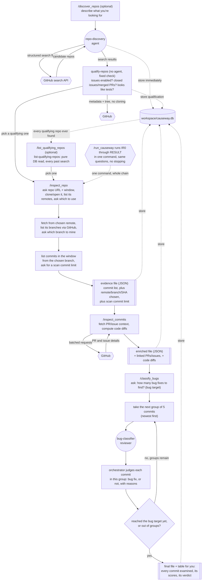

# Causeway Mini

## What is this?

Causeway Mini looks through a public GitHub project's history and figures out which past changes were actually bug fixes, as opposed to new features, cleanup, or documentation changes, and explains why it thinks so for each one.

You point it at a repo, tell it how far back in time to look, and it works through the history in stages. It finds the candidate commits, digs up extra context about each one from GitHub (was there a bug report, a pull request discussion), looks at the actual code that changed, and then has a few independent AI reviewers weigh in before settling on a final answer for each commit, stopping once it has found as many genuine bug fixes as you asked for. If you don't already know which repo you want, you can also describe what you're looking for in plain language (language, popularity, activity, and so on) and it searches GitHub for candidates first.

Everything is run through a handful of chat commands, typed one after another, each one picking up where the last left off. `/run_causeway` runs the whole thing in one command; `/inspect_repo`, `/inspect_commits`, and `/classify_bugs` run the same three stages one at a time, for when you'd rather stop and look between them.

## Tech stack

- **Scala 3**: the programming language the actual data-processing tools are written in.
- **sbt 2**: the build tool that compiles and runs the Scala code.
- **JGit**: reads a git repository's history and computes diffs directly, without needing the `git` command line tool installed separately.
- **GitHub GraphQL API**: fetches the pull requests and issues linked to a commit.
- **GitHub REST search API**: finds candidate repositories from structured criteria (language, stars, activity, and so on).
- **upickle/ujson**: reads and writes the JSON files passed between stages.
- **SQLite (via the `sqlite-jdbc` driver)**: a repository catalog, `workspace/causeway.db`, that every stage's output also gets stored into, queryable directly across every run ever done.
- **Claude Code commands and subagents**: the chat commands (`/run_causeway`, etc.) and the AI reviewers are plain instruction files that Claude Code reads and follows.
- **The `causeway` CLI**: a small launcher script that runs the compiled Scala tools directly, no `sbt` involved at invocation time.

## Code files, and what they actually do

### `build.sbt` and `project/build.properties`

`build.sbt` declares this as a Scala 3 project and lists its dependencies (JGit, upickle, `sqlite-jdbc`, MUnit for tests). `project/build.properties` pins the sbt version.

### `src/main/scala/causeway/mini/Causeway.scala`

The one compiled entry point. Dispatches on its first argument (`search-repos`, `qualify-repos`, `list-qualifying-repos`, `repo-details`, `inspect-repo`, `inspect-commits`, `store`) to that capability's own `run`.

### `tools/causeway`

The launcher script the chat commands call, e.g. `tools/causeway inspect-repo --mode list-remotes ...`. Runs already-compiled classes directly; recompiles automatically the first time it's invoked after a source or `build.sbt` change. Also sources `.env` itself before running anything, so `GITHUB_TOKEN` is always available.

### `src/main/scala/causeway/mini/SearchRepos.scala`

The `search-repos` subcommand. Takes structured flags (language, a star range, how recently active, a size range, a fork-count range, a repo-age range, fork/archived status, topics, license, a result cap), builds them into GitHub's repository search qualifier syntax, and pages through results (100 at a time, up to GitHub's 1000-result ceiling). Every discovered repository is inserted straight into `workspace/causeway.db` as it's found, tagged with the exact search specification (a `search_repos_runs` row) that discovered it. Translating a person's plain-language request into these flags is the `repo-discovery` agent's job, not this tool's.

### `src/main/scala/causeway/mini/QualifyRepos.scala`

The `qualify-repos` subcommand: a cheap pre-clone check on whatever `search-repos` just found. Asks GitHub whether issues are enabled, how many closed/open issues and merged/open pull requests exist, and how many files in the repo's tree look like tests (a recursive tree listing, paths only, pattern-matched against common test-file conventions). Issues disabled, or zero closed issues and zero merged PRs, rejects the repository outright; everything else is recorded but never causes a rejection on its own. Fully mechanical, invoked directly rather than through an agent. The same metadata call also captures `description`/`repo_created_at`/`forks_count`/`topics`/`default_branch` and the `current_stars`/`current_language`/`current_size_kb`/`current_archived`/`current_fork`/`current_license` snapshot, both fed into `repositories` through the same shared upsert `search-repos` uses.

### `src/main/scala/causeway/mini/ListQualifyingRepos.scala`

The `list-qualifying-repos` subcommand: a pure database read. Lists every repository that currently qualifies, most-starred first, up to a given `--limit`, with its issue/PR/test-file counts and whether it's already been mined. Deliberately lean output; `RepoDetails` below is the fuller picture for one chosen repo.

### `src/main/scala/causeway/mini/RepoDetails.scala`

The `repo-details` subcommand: another pure database read, for one repository at a time — its description, topics, license, creation date, and current archived/fork status. Shown once someone actually picks a repository to mine, not for every candidate in a results table.

### `src/main/scala/causeway/mini/InspectRepo.scala`

The `inspect-repo` subcommand. Runs as one of four modes, each a separate invocation, so an orchestrator can show real options to the user between them:

1. **`list-remotes`**: clones the repo with JGit (or opens an existing local copy), then prints every remote actually configured there, name and URL. This is also where a bad repo URL is caught, cloning simply fails.
2. **`list-branches`**, given a chosen remote name: fetches from that remote and asks GitHub's REST API for every branch on that repository, each with its current commit SHA, flagging whichever one GitHub calls the default.
3. **`count`**, given a chosen remote, branch, and its exact SHA: walks every commit reachable from that pinned commit, checking each one's timestamp individually, and prints how many fall in the window. Writes nothing.
4. **`write`**, same inputs as `count` plus a scan commit limit: writes every commit in the window (sha, short/full message, commit date, parent shas), plus the chosen remote/branch/SHA, to a JSON evidence file.

`count` and `write` trust the given `--branch-sha` outright, they don't re-fetch or re-resolve it.

### `src/main/scala/causeway/mini/EnrichCommits.scala`

The `inspect-commits` subcommand:

1. Reads the evidence file `InspectRepo` produced.
2. Takes only as many commits as the scan commit limit allows.
3. Asks GitHub's GraphQL API for the pull requests linked to those commits (and each PR's own commit list and closed issues), batching up to 20 commits per request.
4. For every issue discovered that way, asks a second batched query for that issue's own timeline and body text.
5. For every non-merge commit, computes the before/after code diff using JGit.
6. Skips merge commits, they have no single "before and after" to diff against.
7. Writes a new JSON file with all of this added, leaving the original untouched.

### `src/main/resources/schema.sql`

The SQLite schema, organized into two kinds of table, distinguishable by name alone:

- **Run tables** (`search_repos_runs`, `inspect_repo_runs`, `inspect_commits_runs`, `classify_bugs_runs`): one row per invocation of a pipeline stage, recording exactly what was asked for. Always end in `_runs`.
- **Catalog tables** (everything else — `repositories`, `repository_snapshots`, `commits`, `pull_requests`, `issues`, `relations`, `bug_classifications`, plus each run table's own membership/snapshot join table): the actual discovered facts. A run's membership table is named after its run table plus what it links, so it's traceable at a glance: `inspect_repo_run_commits` (which commits an `inspect_repo_runs` row touched) and `search_repos_run_repositories` (which repositories a `search_repos_runs` row found).

`repositories` carries qualification data (`has_issues` through `checked_at`) directly as nullable columns, `NULL` until `qualify-repos` checks a repository. There's no separate `qualifies` boolean; "qualifies" is the query condition `checked_at IS NOT NULL AND rejection_reason IS NULL`. It also carries `description`/`repo_created_at`/`forks_count`/`topics`/`default_branch` (populated by whichever tool sees a repository first) and `current_stars`/`current_language`/`current_size_kb`/`current_archived`/`current_fork`/`current_license` (the single "what does this repository currently look like" snapshot, written by both `search-repos` and `qualify-repos` every time either one sees a repository). `search_repos_run_repositories` separately keeps its own per-search historical snapshot (what a repo looked like at the moment each search found it).

`relations` is a typed edge table: a `relation_type` column says whether a row is, for example, a commit belonging to a PR or that PR closing an issue, rather than one generic "this commit relates to this issue" fact (see "How a commit connects to a PR or an issue" below). Indexed on each of its three endpoint columns.

### `src/main/scala/causeway/mini/Store.scala`

The `store` subcommand. Takes any JSON file one of the three pipeline stages produced, detects which of the three it is by which fields are present, and upserts its contents into `workspace/causeway.db`. Storing the same file twice, or storing two different runs against the same repository, updates or reuses existing rows rather than duplicating.

### `.claude/agents/repo-discovery.md`

The repository discovery agent's instructions. Has access to exactly one tool, Bash, used for exactly one purpose: running `tools/causeway search-repos ...`. Its job is translation: turning a plain-language description into the tool's structured flags, asking rather than guessing at a number when a threshold isn't given.

### `.claude/commands/discover_repos.md`

Asks what kind of repository the user is looking for and how many candidates they want, hands that to the `repo-discovery` agent, then runs `qualify-repos` directly on whatever was found before showing anything, and offers to remember a chosen repo's URL for `/inspect_repo` or `/run_causeway`.

### `.claude/commands/list_qualifying_repos.md`

Asks how many repositories to show, runs `list-qualifying-repos` directly, shows the results, and offers to remember a chosen repo's URL the same way `/discover_repos` does.

### `.claude/commands/run_causeway.md`

Runs the entire pipeline in one command: gathers the repo URL and window, discovers and picks a remote and branch, asks for a scan commit limit, writes and stores the evidence file, enriches and stores it, asks for a bug target, classifies commits, and writes and stores the final file — the same steps `/inspect_repo`, `/inspect_commits`, and `/classify_bugs` each do on their own, chained together without stopping in between.

### `.claude/commands/inspect_repo.md`

Gathers the repo URL and time window (reusing either one already known from earlier in the session), lists the repo's configured remotes and lets the user choose one, lists that remote's branches via GitHub and lets the user choose one, resolves the window to a date, previews the commit count, asks for a scan commit limit, writes the evidence file, and stores it.

### `.claude/commands/inspect_commits.md`

Finds the evidence file from the previous step, runs the enrichment tool, stores the resulting file, and shows a few example results.

### `.claude/commands/classify_bugs.md`

Finds the enriched file, asks how many genuine bug fixes to find (the bug target), works through the commits in groups of 5, newest first, sending each group to its own AI reviewer and judging the results as they come back, stopping once the target is reached. Shows a table, writes the final file, and stores it.

### `.claude/agents/bug-classifier.md`

Each AI reviewer's instructions: score a commit message, its code diff, and its linked pull requests/issues, each from 0.0 to 1.0 with a short explanation, in a fixed reply format.

## The commands, in order

Each command is typed into the chat, for example `/run_causeway`. Every command ends by telling you what to run next, and by telling you how to redo that step if something looks wrong.

### 0. `/discover_repos` (optional, only if you don't already know which repo to mine)

The command asks what kind of repository you're looking for, in plain language, and how many candidates you'd like at most. It hands that description to the `repo-discovery` agent, which translates it into `search-repos`'s structured flags and runs it. Every result is inserted into `workspace/causeway.db` immediately. Before showing you anything, it runs `qualify-repos` on those same results directly.

Real output, searching for small-to-mid JSON libraries in Java:

```
$ tools/causeway search-repos --language Java --topics json --min-stars 1000 --max-results 5
REPO owner=chinabugotech repo=hutool stars=30273 language=Java sizeKb=75368 url=https://github.com/chinabugotech/hutool
REPO owner=opendataloader-project repo=opendataloader-pdf stars=29103 language=Java sizeKb=87739 url=https://github.com/opendataloader-project/opendataloader-pdf
REPO owner=alibaba repo=fastjson stars=25594 language=Java sizeKb=15533 url=https://github.com/alibaba/fastjson
REPO owner=redisson repo=redisson stars=24392 language=Java sizeKb=36918 url=https://github.com/redisson/redisson
REPO owner=apple repo=pkl stars=11518 language=Java sizeKb=9159 url=https://github.com/apple/pkl
SEARCH_RUN_ID=0ff90ebd-11f0-4bdc-9a3a-92a465f246b5
RESULT_COUNT=5

$ tools/causeway qualify-repos --search-run-id 0ff90ebd-11f0-4bdc-9a3a-92a465f246b5
QUALIFY owner=chinabugotech repo=hutool qualifies=true closedIssues=3118 openIssues=2 mergedPrs=540 openPrs=0 testFiles=1038
QUALIFY owner=opendataloader-project repo=opendataloader-pdf qualifies=true closedIssues=126 openIssues=66 mergedPrs=394 openPrs=27 testFiles=110
QUALIFY owner=alibaba repo=fastjson qualifies=true closedIssues=1693 openIssues=1935 mergedPrs=418 openPrs=177 testFiles=3305
QUALIFY owner=redisson repo=redisson qualifies=true closedIssues=5688 openIssues=184 mergedPrs=792 openPrs=65 testFiles=1085
QUALIFY owner=apple repo=pkl qualifies=true closedIssues=267 openIssues=176 mergedPrs=886 openPrs=49 testFiles=5335
QUALIFIED_COUNT=5
REJECTED_COUNT=0
```

Picking `apple/pkl` and looking closer before committing to it:

```
$ tools/causeway repo-details --owner apple --repo pkl
DESCRIPTION=A configuration as code language with rich validation and tooling.
TOPICS=config,configuration,data,functional,java,json,kotlin,language,...
FORKS_COUNT=403
DEFAULT_BRANCH=main
REPO_CREATED_AT=2024-01-19T17:28:45Z
CURRENT_STARS=11518
CURRENT_LANGUAGE=Java
CURRENT_SIZE_KB=9159
CURRENT_ARCHIVED=false
CURRENT_FORK=false
CURRENT_LICENSE=Apache-2.0
```

### 0b. `/list_qualifying_repos` (optional, revisit repositories found by any past search)

Asks how many results to show, then reads straight from `workspace/causeway.db`, no network call. Shows every repository currently marked qualifying, across every `/discover_repos` run ever done, most-starred first.

Real output, on a catalog that's accumulated 15 qualifying repositories across several past searches:

```
$ tools/causeway list-qualifying-repos --limit 5
REPO owner=chinabugotech repo=hutool stars=30273 language=Java sizeKb=75368 closedIssues=3118 openIssues=2 mergedPrs=540 openPrs=0 testFiles=1038 alreadyMined=false url=https://github.com/chinabugotech/hutool
REPO owner=opendataloader-project repo=opendataloader-pdf stars=29103 language=Java sizeKb=87739 closedIssues=126 openIssues=66 mergedPrs=394 openPrs=27 testFiles=110 alreadyMined=false url=https://github.com/opendataloader-project/opendataloader-pdf
REPO owner=alibaba repo=fastjson stars=25594 language=Java sizeKb=15533 closedIssues=1693 openIssues=1935 mergedPrs=418 openPrs=177 testFiles=3305 alreadyMined=false url=https://github.com/alibaba/fastjson
REPO owner=redisson repo=redisson stars=24392 language=Java sizeKb=36918 closedIssues=5688 openIssues=184 mergedPrs=792 openPrs=65 testFiles=1085 alreadyMined=false url=https://github.com/redisson/redisson
REPO owner=elastic repo=logstash stars=14940 language=Java sizeKb=135085 closedIssues=5151 openIssues=1992 mergedPrs=7239 openPrs=263 testFiles=785 alreadyMined=false url=https://github.com/elastic/logstash
TOTAL_QUALIFYING=15
SHOWN=5
```

### 1. `/run_causeway` — the whole pipeline in one command

Asks for a repo URL (or reuses one already known), asks for a time window, discovers and picks a remote and branch, previews the commit count and asks for a scan commit limit, writes and stores the evidence file, enriches and stores it, asks for a bug target, classifies commits in batches, and writes and stores the final file — one continuous run, no stopping in between.

Real output, mining `stleary/JSON-java`'s past 3 months:

```
What is the url of the repo? https://github.com/stleary/JSON-java
How far back should Causeway Mini look for candidate bug-fixing commits? Past 3 months

$ tools/causeway inspect-repo --repo-url https://github.com/stleary/JSON-java --mode list-remotes
REMOTE name=origin url=https://github.com/stleary/JSON-java
(only one remote, using it)

$ tools/causeway inspect-repo --repo-url https://github.com/stleary/JSON-java --mode list-branches --remote-name origin
BRANCH name=master sha=4f859fdf3b5669894c5ed8a305ee5cd5f1fe2b7a isDefault=true
(...19 other branches...)
(default branch accepted)

$ tools/causeway inspect-repo ... --mode count --since-date 2026-06-12 --window-label past-3-months
WINDOW_COMMIT_COUNT=28

There are 28 commits in this window. How many should be scanned in detail? 6

$ tools/causeway inspect-repo ... --mode write --scan-commit-limit 6
WINDOW_COMMIT_COUNT=28
EVIDENCE_FILE=workspace/exports/run_7e502434-a815-4663-a2fe-c5e775da3f87.json
RUN_ID=7e502434-a815-4663-a2fe-c5e775da3f87

$ tools/causeway inspect-commits --evidence-file workspace/exports/run_7e502434-a815-4663-a2fe-c5e775da3f87.json
Enriching 6 of 28 window commits (scanCommitLimit=6)
ENRICHED_COUNT=6
ENRICHED_FILE=workspace/exports/run_7e502434-a815-4663-a2fe-c5e775da3f87_enriched.json
SAMPLE sha=4f859fdf3b prCount=1 diffFileCount=0 isMergeCommit=true
SAMPLE sha=3dd0ec02f2 prCount=1 diffFileCount=3 isMergeCommit=false
SAMPLE sha=6c14048079 prCount=1 diffFileCount=0 isMergeCommit=true

Enriched commits available: 6. How many genuine bug fixes would you like to find, at most? 1
```

Batch 1 (5 commits, newest first) goes to a `bug-classifier` reviewer, which returns real scores:

| sha | message | diff | PR/issue | verdict | reason |
|---|---|---|---|---|---|
| 4f859fdf3b | 0.75 | n/a (merge) | 0.85 | not counted | Merge commit with no diff of its own, the actual fix is in the commit below |
| 3dd0ec02f2 | 0.55 | 0.50 | 0.80 | **bug fix** | Closes a real, confirmed security vulnerability (CWE-91 XML element injection, issue #1071): JSON keys containing XML metacharacters could break out of their element and inject arbitrary XML structure. The diff narrows `XML.toString`'s validation to reject exactly those metacharacters, with new tests asserting the rejection |
| 6c140480 | 0.05 | n/a (merge) | 0.10 | not a bug fix | Routine release-prep merge |
| 34efda64 | 0.05 | 0.15 | 0.10 | not a bug fix | Version bump and changelog entry, not the fix itself |
| 22ab2fb7 | 0.20 | 0.25 | 0.00 | not a bug fix | Documentation link correction, no application code change |

```
Examined 5 of 6 scanned commits, stopped early after reaching your
target of 1 genuine bug fix.
Final file: workspace/exports/run_7e502434-a815-4663-a2fe-c5e775da3f87_classified.json
```

### Running stages individually

`/inspect_repo`, `/inspect_commits`, and `/classify_bugs` are the same three stages `/run_causeway` chains together, run one at a time instead, each stopping to report its own result and telling you which command to run next. Use these instead of `/run_causeway` when you want to look at a stage's output (how many commits fell in the window, what got enriched, the classification table) before deciding whether to continue.

The evidence file's `repoSnapshot` records exactly what was mined:

```json
{
  "remoteName": "origin",
  "branch": "master",
  "remoteHeadSha": "4f859fdf3b5669894c5ed8a305ee5cd5f1fe2b7a",
  "retrievedAt": "2026-09-12T22:46:03.873518700Z"
}
```

One commit from that same file (trimmed):

```json
{
  "sha": "3dd0ec02f25c7c8f716fd62e1e3ffc6254004275",
  "shortMessage": "#1071: narrow tag-name check to XML metachars only",
  "fullMessage": "#1071: narrow tag-name check to XML metachars only\n\n...",
  "commitDate": "2026-08-20T15:14:07Z",
  "parentShas": ["6b993e2e47b9a328a9d166a720b33fa7e3e58848"]
}
```

The same commit after `/inspect_commits`, with `pullRequests` and `diff` added (diff shortened here):

```json
{
  "sha": "3dd0ec02f25c7c8f716fd62e1e3ffc6254004275",
  "shortMessage": "#1071: narrow tag-name check to XML metachars only",
  "pullRequests": [
    {
      "number": 1072,
      "title": "Reject invalid XML element names",
      "state": "MERGED",
      "closingIssues": [
        { "number": 1071, "title": "XML.toString: unescaped keys allow XML element injection (CWE-91) — proposal to throw per #294" }
      ],
      "commitShas": ["e2cfb5a64150455bf63ad334da9827e7671c9133", "6b993e2e47b9a328a9d166a720b33fa7e3e58848", "3dd0ec02f25c7c8f716fd62e1e3ffc6254004275"],
      "commitTotalCount": 3
    }
  ],
  "diff": {
    "isMergeCommit": false,
    "parentSha": "6b993e2e47b9a328a9d166a720b33fa7e3e58848",
    "files": [
      {
        "path": "src/main/java/org/json/XML.java",
        "changeType": "MODIFY",
        "patch": "@@ -233,80 +233,27 @@\n-    static void mustBeXmlName(String string) ...\n+    static void noXmlMetachars(String string) ..."
      }
    ]
  }
}
```

## The SQLite catalog

Every command above, after writing its own JSON file, also stores that file's contents into `workspace/causeway.db`. This happens automatically. The database is queryable directly, across every run ever done, rather than only ever being read one JSON file at a time.

Repeating a step (say, re-running `/inspect_repo` for the same repo and window) updates the existing rows rather than creating duplicates. Mining the same repo again with a different window creates a second, separate run; both still share the one row for the repository itself, and a commit rediscovered by both runs is still just one row in `commits`, linked to both.

### How a commit connects to a PR or an issue

A commit belonging to a PR, a PR closing an issue, and a commit's own message merely mentioning an issue number are three different claims with three different strengths of evidence, kept as distinctly-typed rows in one `relations` table (a `relation_type` column says which kind each row is, `evidence` records the source text or GitHub field that established it). Querying across relation types is a `WHERE relation_type = '...'`, or no filter at all for "every relation touching this commit."

All seven relation types currently populated:

| `relation_type` | Endpoints | Source | Evidence |
|---|---|---|---|
| `commit_associated_pr` | commit, PR | `Commit.associatedPullRequests` | `"Commit.associatedPullRequests"` |
| `pr_contains_commit` | commit, PR | that PR's own `commits` list actually contains the sha | note + the PR's total commit count |
| `pr_closes_issue` | PR, issue | `PullRequest.closingIssuesReferences` | `"PullRequest.closingIssuesReferences"` |
| `pr_mentions_issue` | PR, issue | the issue's own `CrossReferencedEvent` timeline, source a PR | — |
| `commit_mentions_issue` | commit, issue | the issue's own `ReferencedEvent` timeline (GitHub-confirmed) | note, flags a cross-repository reference |
| `issue_mentions_commit` | commit, issue | a commit-SHA-shaped token found in the issue's own body text | the matched token |
| `commit_message_references_issue` | commit, issue | a raw `#123`-shaped match in the commit's own message | the matched `#N` |

`commit_associated_pr` and `pr_contains_commit` can disagree: a merge commit typically gets a `commit_associated_pr` row (GitHub resolves it as associated with the PR it merged) with no matching `pr_contains_commit` row (that PR's own commit list usually doesn't include the merge commit itself). `pr_mentions_issue` and `pr_closes_issue` can likewise both exist for the same PR/issue pair, or just one.

This finds every genuine bug fix found so far, across every classification run, joining through whichever PR actually closed the linked issue:

```sql
SELECT c.sha, c.short_message, i.title AS issue_title, bc.verdict_rationale
FROM bug_classifications bc
JOIN commits c ON c.sha = bc.commit_sha
LEFT JOIN relations associated ON associated.relation_type = 'commit_associated_pr' AND associated.commit_sha = c.sha
LEFT JOIN relations closes ON closes.relation_type = 'pr_closes_issue' AND closes.pull_request_id = associated.pull_request_id
LEFT JOIN issues i ON i.id = closes.issue_id
WHERE bc.verdict = 1;
```

Real output, including the JSON-java commit classified above:

```
3dd0ec02f2 | #1071: narrow tag-name check to XML metachars only | XML.toString: unescaped keys allow XML element injection (CWE-91) — proposal to throw per #294 | Closes a real, confirmed security vulnerability (CWE-91 XML...
```

### Discovered repositories

`/discover_repos` writes to the catalog directly, there's no JSON file for it. `search_repos_runs` holds the exact specification of each search (language, star bounds, activity window, size bounds, fork-count bounds, repo-age bounds, fork/archived status, `topic_filter`, license, the requested result cap); `search_repos_run_repositories` links that search to every repository it found, each with a snapshot of that repository's stars/language/last-pushed-date/etc. at the moment that search found it. This finds every repository any search has ever surfaced with at least 10,000 stars, and which search found each one:

```sql
SELECT r.owner, r.repo, srr.stars, sr.language, sr.min_stars, sr.created_at
FROM search_repos_run_repositories srr
JOIN repositories r ON r.id = srr.repository_id
JOIN search_repos_runs sr ON sr.id = srr.search_repos_run_id
WHERE srr.stars >= 10000
ORDER BY srr.stars DESC;
```

Real output (top 5):

```
chinabugotech      | hutool             | 30273 | Java | 1000 | 2026-09-12 22:44:05
opendataloader-project | opendataloader-pdf | 29103 | Java | 1000 | 2026-09-12 22:44:05
alibaba             | fastjson           | 25594 | Java | 1000 | 2026-09-12 22:44:05
redisson            | redisson           | 24392 | Java | 1000 | 2026-09-12 22:44:05
apple               | pkl                | 11518 | Java | 1000 | 2026-09-12 22:44:05
```

## How it all fits together



## Running the whole workflow

1. Make sure `.env` exists at the project root with a valid `GITHUB_TOKEN` in it.
2. Open this project in Claude Code.
3. Don't already have a specific repo in mind? Type `/discover_repos` first, describe what you're looking for, and pick one of the results. Already ran `/discover_repos` before and want to revisit an older result? Type `/list_qualifying_repos` instead. Skip either if you already know the repo.
4. Type `/run_causeway` to run the whole pipeline in one go, answering its questions (repo URL, window, remote/branch if there's a choice, scan commit limit, bug target) as they come up. Or, for more control between stages, type `/inspect_repo`, then `/inspect_commits`, then `/classify_bugs` instead, one at a time.
5. Read the table `/classify_bugs` (or `/run_causeway`) prints, and open the final JSON file it mentions for the full detail behind every score.
6. If any step's result looks wrong, run that same command again to redo it.
7. Everything written to a JSON file along the way is also sitting in `workspace/causeway.db`, queryable directly with any SQLite client.
