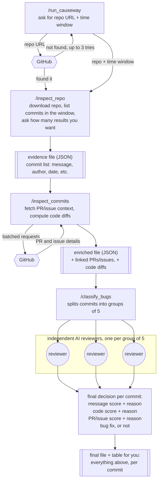

# Causeway Mini

## What is this?

Causeway Mini looks through a public GitHub project's history and figures out which past changes were actually bug fixes, as opposed to new features, cleanup, or documentation changes, and explains why it thinks so for each one.

You point it at a repo, tell it how far back in time to look and how many results you want, and it works through the history in stages. It finds the candidate commits, digs up extra context about each one from GitHub (was there a bug report, a pull request discussion), looks at the actual code that changed, and then has a few independent AI reviewers weigh in before settling on a final answer for each commit.

Everything is run through a handful of chat commands, typed one after another, each one picking up where the last left off.

## Tech stack

- **Scala 3**: the programming language the actual data-processing tools are written in.
- **sbt 2**: the build tool that compiles and runs the Scala code.
- **JGit**: a library that lets the Scala code read a git repository's history and compute diffs directly, without needing the `git` command line tool installed separately.
- **GitHub GraphQL API**: used to fetch the pull requests and issues linked to a commit, straight from GitHub, rather than guessing from the commit message alone.
- **upickle/ujson**: a small library for reading and writing the JSON files this project passes between its stages.
- **Claude Code commands and subagents**: the chat commands (`/run_causeway`, etc.) and the AI reviewers are plain instruction files that Claude Code reads and follows, no extra framework needed.

## Code files, and what they actually do

### `build.sbt` and `project/build.properties`

These two files are the project's setup. `build.sbt` says this is a Scala 3 project, lists the two outside libraries it needs (JGit and upickle), and turns on a compiler warning flag. `project/build.properties` pins the exact version of sbt to use, so the build behaves the same on any machine.

### `src/main/scala/causeway/mini/InspectRepo.scala`

This is the tool behind `/inspect_repo`. Internally it:

1. Reads its command line flags: the repo URL, the cutoff date for the time window, and (optionally) a results cap.
2. Downloads the repo with JGit if it hasn't already been downloaded, or reuses the existing copy if it has.
3. Walks backward through the commit history, starting from the newest commit.
4. Stops as soon as it reaches a commit older than the chosen cutoff date, since everything after that point is guaranteed to be older too.
5. If it was only asked to count (a "preview" mode), it just prints how many commits it found and stops there, without writing anything.
6. Otherwise, it writes every commit it found, message, author, date, and so on, into a JSON file.

### `src/main/scala/causeway/mini/EnrichCommits.scala`

This is the tool behind `/inspect_commits`. Internally it:

1. Reads the JSON file that `InspectRepo` produced.
2. Takes only as many commits as the results cap allows (the most recent ones).
3. Asks GitHub's GraphQL API for the pull requests and issues linked to those commits, grouping up to 20 commits into a single request instead of sending one request per commit.
4. For every commit that isn't a merge commit, computes the exact before and after code using JGit, running several of these comparisons at once instead of one at a time.
5. Skips the code comparison for merge commits, since a merge doesn't have one clean "before and after" to point to.
6. Combines all of this into a new JSON file, leaving the original file from step 2 untouched.

### `.claude/commands/run_causeway.md`

Plain instructions for Claude to follow, not code. They say: ask the user for a repo URL, check it against GitHub directly, ask again (up to 3 times) if it isn't found, explain what a time window means, ask the user to choose one, and then point them to `/inspect_repo` next.

### `.claude/commands/inspect_repo.md`

Instructions that say: reuse the repo and time window from the previous command if they're already known, turn the chosen time window into an actual date, run the Scala tool once in preview mode to get a count, tell the user that count and ask for a results cap, run the tool again for real, and point them to `/inspect_commits` next.

### `.claude/commands/inspect_commits.md`

Instructions that say: find the JSON file from the previous step, make sure the GitHub access token is loaded from `.env`, run the enrichment tool, show a few example results, and point the user to `/classify_bugs` next.

### `.claude/commands/classify_bugs.md`

Instructions that say: find the enriched JSON file, split its commits into groups of 5, send each group to its own AI reviewer, collect every reviewer's scores, decide the actual verdict for each commit, show the user a table, and write one final JSON file with everything in it.

### `.claude/agents/bug-classifier.md`

The instructions given to each AI reviewer. They describe the three things to look at (commit message, code diff, linked pull requests or issues), how to score each one from 0.0 to 1.0 with a short explanation, and the exact reply format to use so the results can be read back automatically.

## The commands, in order

Each command is typed into the chat, for example `/run_causeway`. Every command ends by telling you what to run next, and by telling you how to redo that step if something looks wrong.

### 1. `/run_causeway`

What happens, step by step:

The command asks: "What is the url of the repo?" You type a GitHub URL. It checks that URL against GitHub right away. If GitHub says the repo doesn't exist, it tells you plainly and asks again, up to 3 times before giving up. Once a real repo is found, it explains what a time window means (how much history to search through), then offers a few choices: past 1 month, past 3 months, past 6 months, or your own custom period. It does not ask how many results you want yet, that comes later once you can see how many commits are actually in play.

Example output, once a repo and window are settled:

```
Found the repo: stleary/JSON-java.
Window: past 3 months (since 2026-06-05).

Next, run /inspect_repo, which will clone the repo, show how many
commits fall in this window, and ask for a bug cap at that point.

If anything above is wrong, just run /run_causeway again to start over.
```

### 2. `/inspect_repo`

What happens, step by step:

It downloads the repo (or reuses an already-downloaded copy). It counts how many commits fall inside the time window you chose, without writing anything yet. It shows you that number. It asks: "What should be the cap on the number of bugs?" Once you answer, it writes out a JSON file listing every one of those commits.

Example output:

```
There are 28 commits in this window. What should be the cap on the
number of bugs?
```

You answer, say, `5`. Then:

```
Repo: stleary/JSON-java
Window: past 3 months (since 2026-06-05)
Commits in window: 28
Bug cap: 5
Evidence file: workspace/exports/run_a377254a-45cc-4e63-b7ab-32c22082ce0b.json

Next, run /inspect_commits, which will fetch each commit's linked
GitHub PRs/issues and its JGit diff content.

If anything above is wrong, just run /inspect_repo again to start over.
```

One commit from inside that JSON file looks like this (trimmed):

```json
{
  "sha": "3dd0ec02f25c7c8f716fd62e1e3ffc6254004275",
  "shortMessage": "#1071: narrow tag-name check to XML metachars only",
  "fullMessage": "#1071: narrow tag-name check to XML metachars only\n\n...",
  "author": { "name": "...", "email": "...", "date": "2026-08-24T..." },
  "committer": { "name": "...", "email": "...", "date": "2026-08-24T..." },
  "commitDate": "2026-08-24T17:22:44Z",
  "parentShas": ["6b993e2e47b9a328a9d166a720b33fa7e3e58848"]
}
```

### 3. `/inspect_commits`

What happens, step by step:

It finds the JSON file from the previous step. It makes sure the GitHub access token from `.env` is available. For every commit (up to the cap), it asks GitHub for linked pull requests and issues, in batches of up to 20 commits per request rather than one request each. For every non-merge commit, it computes the actual code change using JGit. It writes a new JSON file with all of this added, and shows you a few examples directly.

Example output:

```
Enriched 5 of 28 window commits.
Evidence file: workspace/exports/run_a377254a..._enriched.json

Examples:
- 4f859fdf3b: 1 linked PR, 0 files changed (merge commit, skipped)
- 3dd0ec02f2: 1 linked PR, 3 files changed
- 6c140480: 1 linked PR, 0 files changed (merge commit, skipped)

Next, run /classify_bugs, which will score each commit on whether
it's a genuine bug fix.

If anything above is wrong, just run /inspect_commits again to start over.
```

The same commit from before now has two new fields added, `pullRequests` and `diff` (the diff is shortened here, the real one includes the full code change):

```json
{
  "sha": "3dd0ec02f25c7c8f716fd62e1e3ffc6254004275",
  "shortMessage": "#1071: narrow tag-name check to XML metachars only",
  "fullMessage": "#1071: narrow tag-name check to XML metachars only\n\n...",
  "pullRequests": [
    {
      "number": 1072,
      "title": "Reject invalid XML element names",
      "state": "MERGED",
      "closingIssues": [
        { "number": 1071, "title": "XML.toString: unescaped keys allow XML element injection (CWE-91)" }
      ]
    }
  ],
  "diff": {
    "isMergeCommit": false,
    "parentSha": "6b993e2e47b9a328a9d166a720b33fa7e3e58848",
    "files": [
      {
        "path": "src/main/java/org/json/XML.java",
        "changeType": "MODIFY",
        "patch": "@@ -233,80 +233,27 @@\n-    static void mustBeXmlName(String string) ...\n+    static void noXmlMetachars(String string) ..."
      }
    ]
  }
}
```

### 4. `/classify_bugs`

What happens, step by step:

It finds the enriched JSON file. It splits the commits into groups of 5. It sends each group to its own AI reviewer, all at the same time rather than one after another. Each reviewer scores every commit in its group on three separate things, each from 0.0 to 1.0 with a short explanation: how the commit message reads, what the actual code change looks like, and what any linked pull requests or issues say. Once every group reports back, the final step reads all three scores and explanations for each commit and makes the real call, bug fix or not, with its own short reasoning. It shows you a table, and writes one final JSON file with everything in it.

Example table:

| sha        | message | diff | PR/issue | verdict | reason |
|------------|---------|------|----------|---------|--------|
| 3dd0ec02f2 | 0.75    | 0.80 | 0.85     | bug fix | Rewrites the tag name check to close a real XML injection issue (CWE-91), confirmed by the linked issue and PR |
| 22ab2fb724 | 0.05    | 0.05 | 0.00     | not a bug | Only updates a documentation link, no code behavior changes |

Example final message:

```
Classified 5 commits. Judged 1 as a genuine bug fix.
Final file: workspace/exports/run_a377254a..._classified.json

This is as far as Causeway Mini currently goes, there's no next
command yet.

If anything above is wrong, just run /classify_bugs again to start over.
```

## How it all fits together



Reading it top to bottom: `/run_causeway` gets your repo and time window, checking the repo against GitHub as it goes, retrying up to 3 times on a bad URL. `/inspect_repo` downloads the repo and lists the commits in that window, asking for your results cap once you can see how many there are. The output is a JSON file that every later step builds on. `/inspect_commits` adds GitHub's own context (linked pull requests and issues) and the real code differences for each commit. `/classify_bugs` hands small groups of commits to independent reviewers, each scoring three separate signals with an explanation. The final step weighs all three per commit and renders a verdict, which you see as a table and get saved as one complete file.

## Running the whole workflow

1. Make sure `.env` exists at the project root with a valid `GITHUB_TOKEN` in it.
2. Open this project in Claude Code.
3. Type `/run_causeway` and answer its two questions: the repo URL and the time window.
4. Type `/inspect_repo`. Answer its question about the bug cap once it shows you the commit count.
5. Type `/inspect_commits` and let it run. No questions this time, it reuses everything from before.
6. Type `/classify_bugs` and let it run. This is the step that takes the longest, since it fans out multiple AI reviewers.
7. Read the table it prints, and open the final JSON file it mentions if you want the full detail behind every score.
8. If any step's result looks wrong, just run that same command again to redo it.
